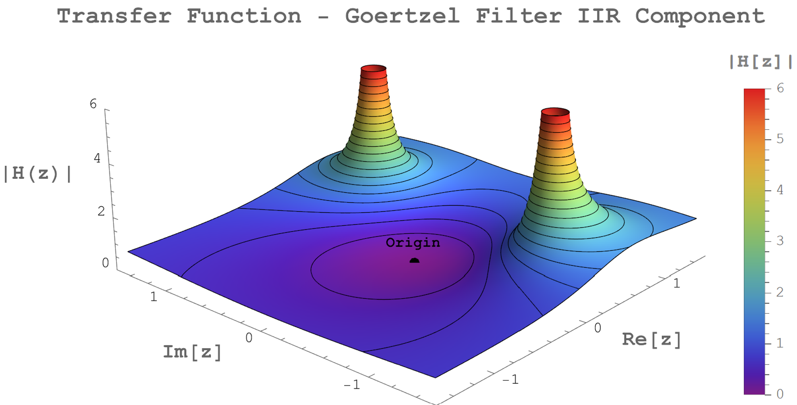
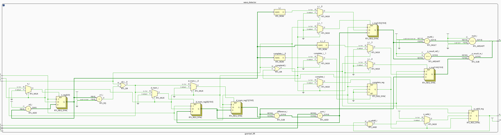
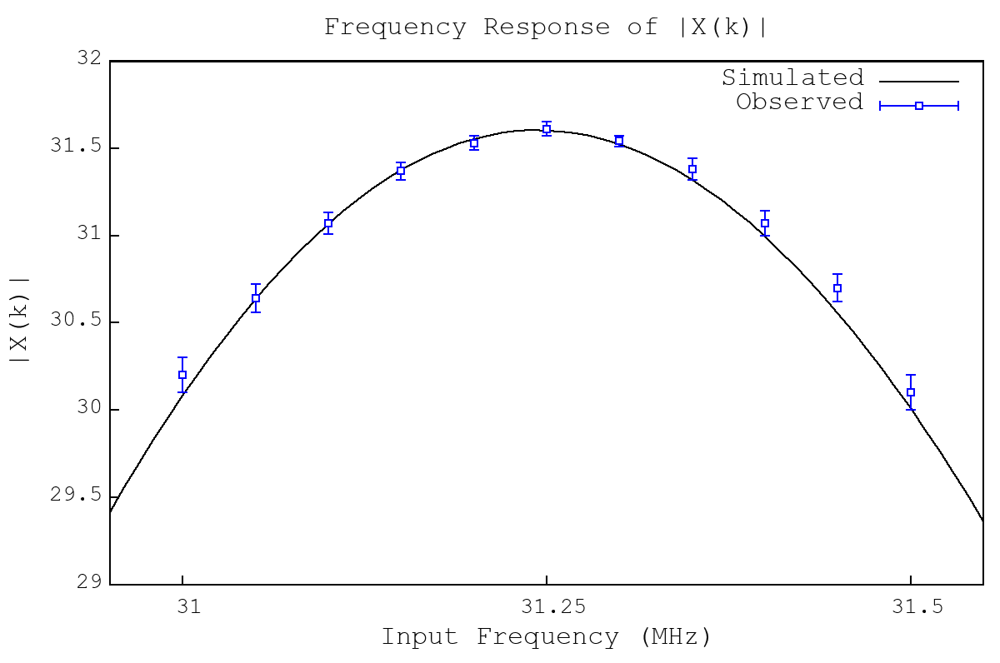
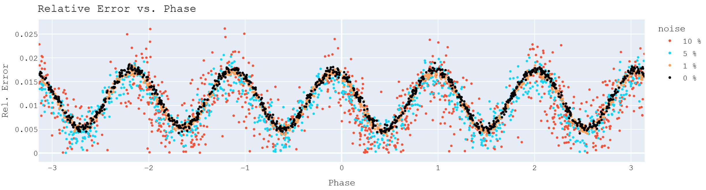

# _Resource-Efficient Discrete Fourier Transform via the Goertzel Algorithm for Continuous Wave Detection with FPGAs_
### by Connor Fricke
---

My thesis paper is available as a pdf in this repository, and also available through the OSU Knowledge Bank:

[OSU Knowledge Bank Listing](https://kb.osu.edu/items/45fe76aa-2d33-46dd-92e4-eadac6306526)

 

